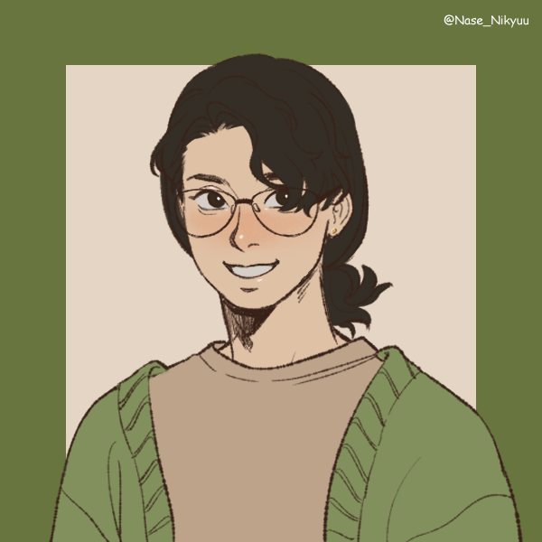

<h1>Bem-vindo!</h1>

- 🌿 Pode me chamar de Mel!

- 🌱 No momento estou aprendendo **Python** e estudando **AWS**

- ☘️ Muita prentenção de me desenvolver em **segurança da informação**

- 🪴 Você pode me achar nas minhas redes sociais:

  
  

 
 
 

  <a href="https://github.com/loeycism">
          <! -- github stats -->
    
           <! -- language use -->
    
           <! -- streak -->
    
    
  </a>

